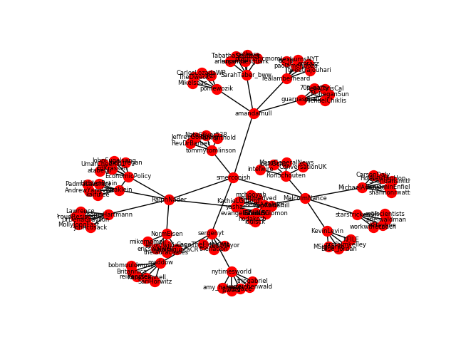

#### code idioms derived from Mining the Social Web, 3rd Edition (Mikhail Klassen, Matthew A. Russell)
#### Overview: Recursively crawl a twitter graph of reciprocal friends--defined as node1 follows and is followed by node2

